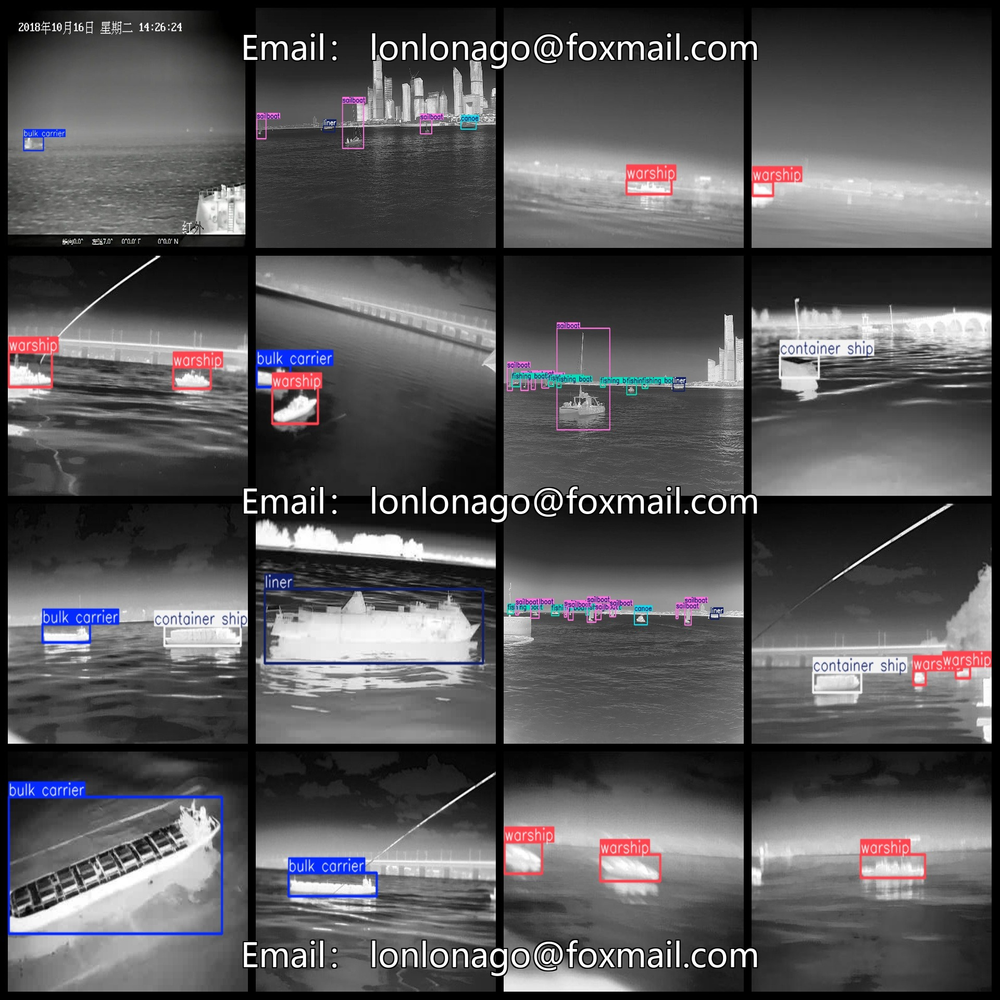
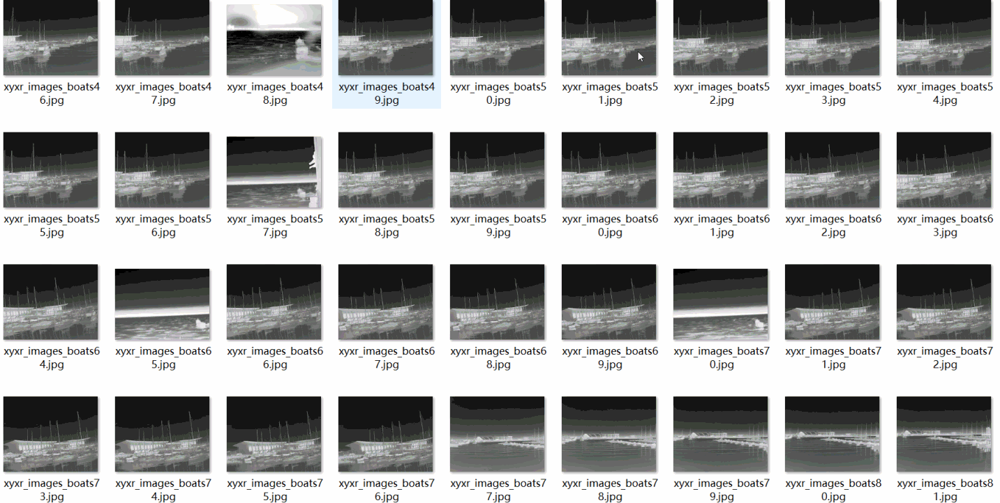

# [Object Detection] Infrared Captured 7 types Water Surface Ship Classification Detection Dataset 8389 images YOLO+VOC format

Dataset Format: Pascal VOC + YOLO (excluding the split-path txt file; only jpg images with corresponding VOC-format xml files and YOLO-format txt files)

The compressed file contains: three folders, each storing images, xml files, and text files.

The total number of jpg images in the JPEGImages folder is 8389.

Total number of xml files in the Annotations folder: 8389

The total number of txt files in the labels folder is 8389.

Total number of tag types: 7

Tag Names: ["bulk carrier", "canoe", "container ship", "fishing boat", "liner", "sailboat", "warship"]

The number of boxes for each label (Note that the order of labels in the Yolo format does not correspond to this, but is based on the classes.txt file in the labels folder):

Bulk carrier keel number = 1939 (bulk carrier)

Canoe Frames = 4926 (Solo Canoe)

Container ship hulls = 692 (container ships)

fishing boat frame count = 9115 (fishing boat)

Liner liner = 1423（Cruise ship）

Sailboat frame number = 5777 (sailing boat)

【2547】

Total frames: 26419

Picture clarity (Resolution: Pixels): Clear

Is the image enhanced: No

Shape of the label: Rectangular box, used for object detection and recognition.

Important Note: None

Special Notice: This dataset does not guarantee the accuracy or precision of the trained models or weight files. The dataset only provides accurate and reasonable annotations.
## Images

---

Here is a pay link on Stripe (https://buy.stripe.com/3cs8yP7sY87d0vu9AB). Please contact me lonlonago@foxmail.com after funding $89, and I will send you a complete data files, thank you!

